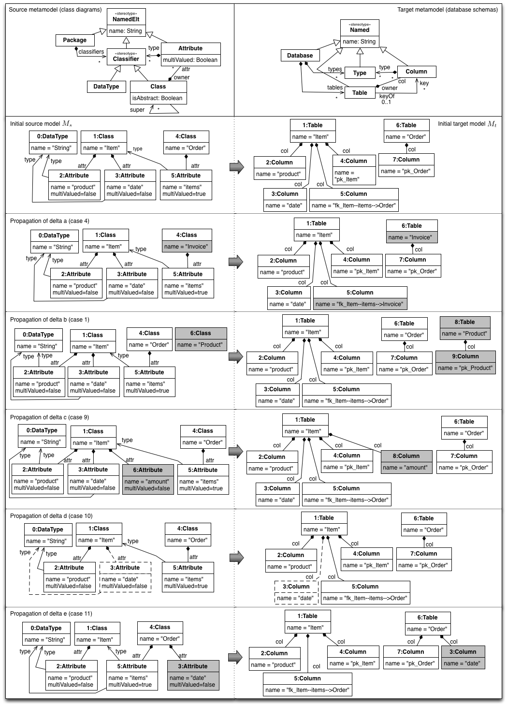

# CD2DB M2M Transformation

This is a sample project that shows how to invoke the YAMTL m2m transformation that maps simple class diagrams to simple relational schemas (in `mapping` `incremental` mode). 

The source deltas that have been implemented are depicted in the figure below:

This project demonstrates how to use **on-the-fly** changes and **offline changes**. There are two versions of the `cd2db` transformation, using native methods as helpers and using managed helpers. For more information on this concepts, check the language reference at [yamtl.github.io](https://yamtl.github.io). 

For offline changes, the EMF change model representation of these source deltas can be found in `src/main/java/cd2db/deltas/`). The correspondence of model changes to change description models is as follows:

* delta a: `delta1`
* delta b: `delta2`
* delta c: `delta3`
* delta d: `delta4`
* delta e: `delta5`

The target models (relational schemas) with the propagated deltas can be found in `src/main/java/cd2db/output/`).  
