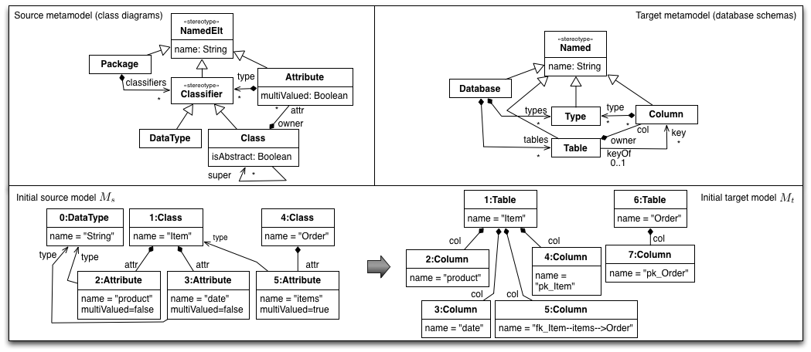

# CD2DB M2M Transformation (YAMTL Xtend)

This is a sample project that shows how to invoke a batch out-place model to model transformation in YAMTL. 

This transformation uses the YAMTL Xtend flavour.

This [m2m transformation](./src/main/java/cd2db/cd2db.xtend) is the YAMTL implementation of a mapping from a [simple class diagram metamodel](./src/main/resources/metamodels/CD.emf) to a [simple database schema metamodel](./src/main/resources/metamodels/Relational.emf). The figure below graphically depicts both the metamodels and the input and output models involved in the example.

See [yamtl.github.io](https://yamtl.github.io) for instructions on how to import and run a YAMTL transformation.).